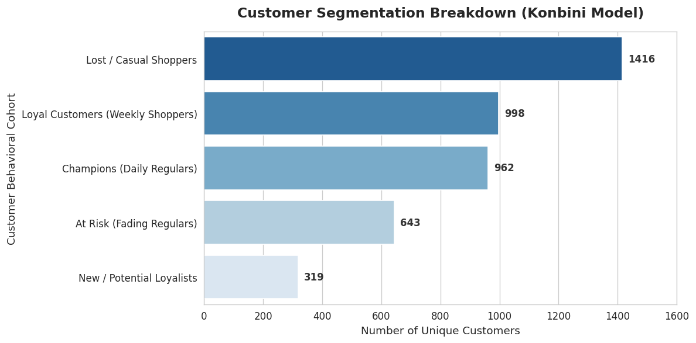

# rfm-customer-segmentation-python
RFM Customer Segmentation analysis on 4,000+ retail customers using Python.
# Customer Behavioral Profiling via RFM Analysis (Konbini Model)

## Executive Summary
This project applies **Recency, Frequency, and Monetary (RFM)** behavioral segmentation on 390,000+ transaction records to profile 4,338 unique customers into 5 distinct behavioral cohorts. Designed for a Japanese Convenience Store (Konbini) corporate marketing strategy to drive targeted promotion campaigns and minimize churn.

---

## 📊 Customer Segmentation Distribution

---

## 🔑 Key Cohort Breakdown & Strategy

* **Casual / Lost Shoppers (1,416 Customers):** Low recency and frequency. Target with low-cost re-engagement notifications.
* **Loyal Customers (998 Customers):** Frequent weekly shoppers. Reward with point-multiplier loyalty programs.
* **Champions - Daily Regulars (962 Customers):** High monetary spend and daily visits. Offer early access to limited-edition bento/seasonal products.
* **At Risk - Fading Regulars (643 Customers):** Previously active but declining recency. Trigger automated coupon incentives for daily staples (coffee, rice balls).
* **New / Potential Loyalists (319 Customers):** Recent first-time buyers. Nurture with welcome discount vouchers.

---

## 🛠️ Tech Stack & Methods
* **Language:** Python 3.x
* **Data Manipulation:** Pandas, NumPy
* **Visualization:** Seaborn, Matplotlib
* **Environment:** Google Colab
* **Scoring Methodology:** Quintile-based scoring ($1-5$ scale) mapped to 5 custom behavioral profiles.
